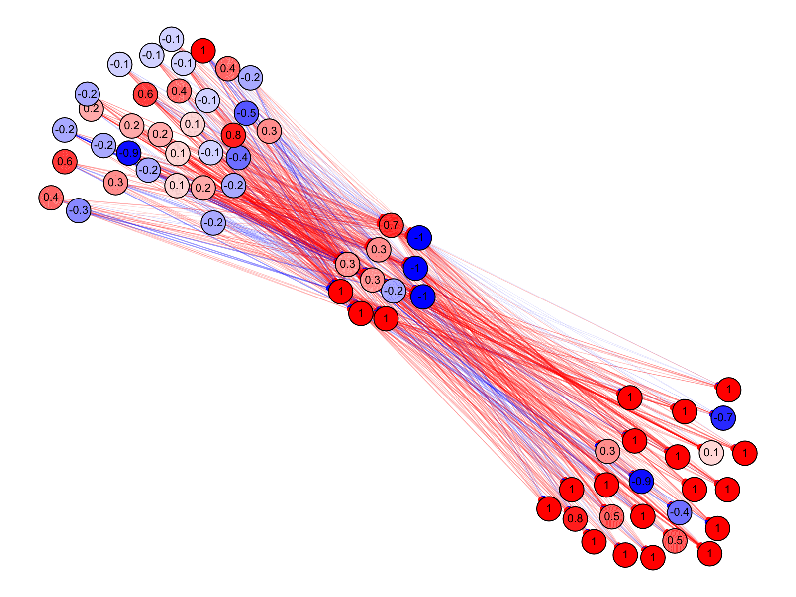

# Simbrain Web


A basic web version of [Simbrain](http://simbrain.net/).

## Live Demo
https://leoyulinli.github.io/simbrain_web/

## Working features
- Creating neuron (using the `P` key) on last click location
- Adjust neuron activations with up and down key
- Drag neurons
- Connecting neurons with a synapse 
  [using the 1, 2 trick](http://simbrain.net/Documentation/docs/Pages/Network/connections.html#quick12)
  and the [all-to-all connection strategy](http://simbrain.net/Documentation/docs/Pages/Network/connections/alltoall.html)
  with self-connection disabled.
- Auto zoom
- Delete screen elements
- Select screen elements
- Multi select (using selection marquee or `shift` key)
- Update network (with `space` key)

## Images


## A note on how to create a network using script
### Creating network
Nothing special. Just call the constructor.
```typescript
const demoNetwork = new Network();
```

### Creating Neuron
The simplest way to add a neuron is to use the `Network#createNeuron` method.
```typescript
const neuron1 = demoNetwork.createNeuron({
  coordinate: { x: 0, y: 100 },
  value: 0.7
});
```
This creates a neuron at location `[0, 100]` and has a initial activation of `0.7`.
The creation method takes an object that has the same signature as the `Neuron`'s constructor. 

For now, it is technically possible to add a neuron directly to the `Network#_neurons` collection,
but that will not properly setup the neuron (e.g. events).

### Creating Synapse
To create a synapse, call the `Network#createSynapse` method.
```typescript
demoNetwork.createSynapse({
  source: neuron1,
  target: neuron2,
  weight: 1.2
});
```
This creates a synapse that connects `neuron1` to `neuron2` with a weight of `1.2`.
The creation method takes an object that has the same signature as the `Neuron`'s constructor,
and the source and target properties are required. Beware that this creation method will return `null`
on invalid arguments.

### Visualizing network
You can add the network to a `NetworkPanel` by
```typescript
const networkPanel = new NetworkPanel(demoNetwork);
```
For now, the support for multiple networkPanel is unknown.
Will have to look more into how to deal with multiple canvas and projects with paper.js.
